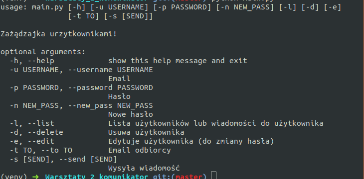

# Warsztaty_2_komunikator

Program for massage sharing, with login etc.
- Used tools and technologies: Python, argparse, psycopg2

1. cd to the directory of repository.
2. activate your virtualenv.
3. run: `pip install -r requirements.txt` in your shell.
4. run: `python3 main.py -h` for further instructions.
